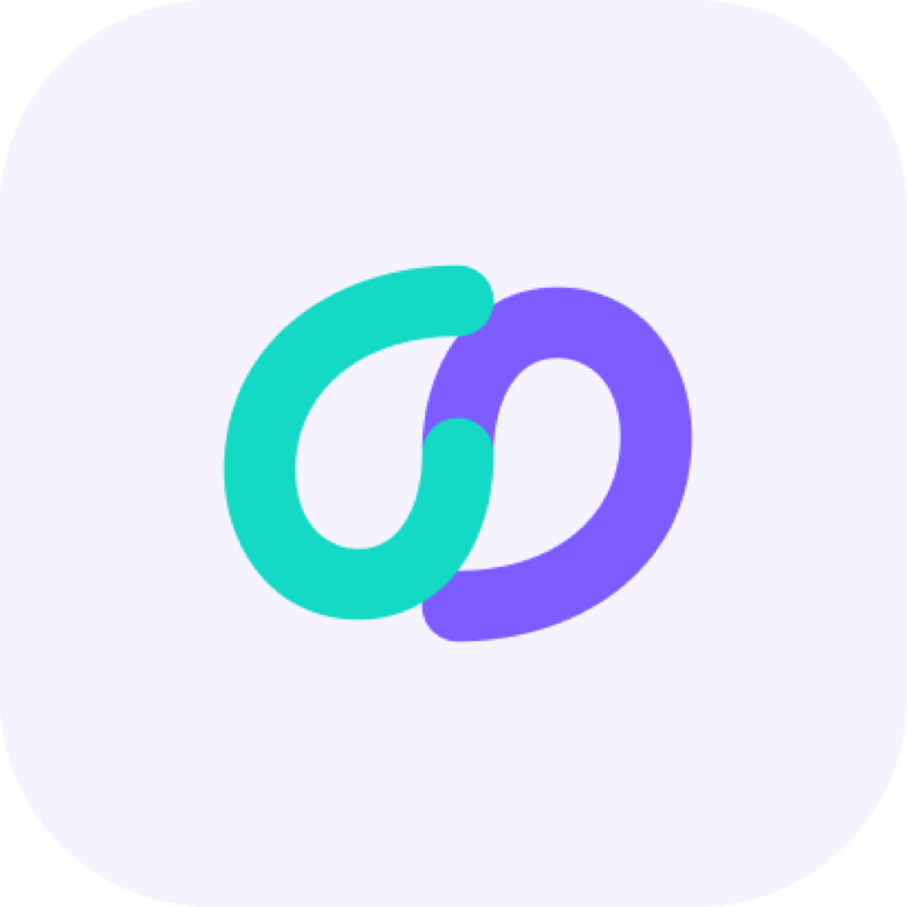
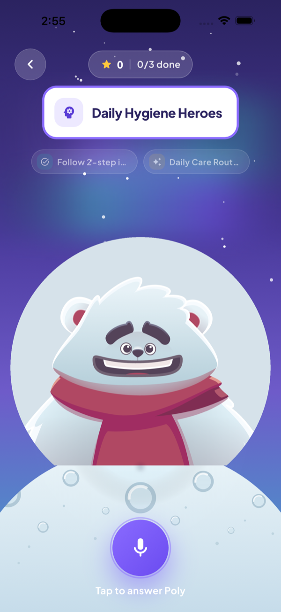
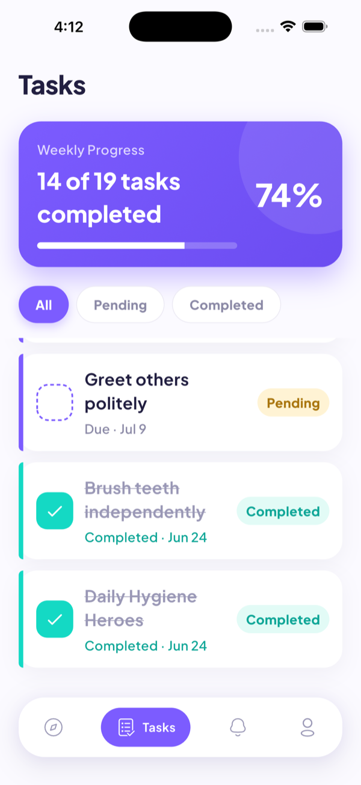
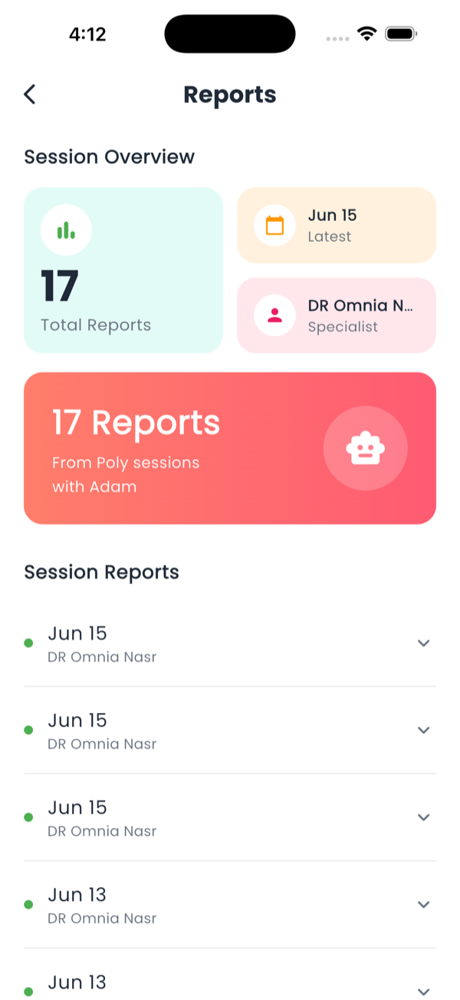

<div align="center">



# inside-out 🧸

### Meet **Dooby** — an AI bear that helps neurodiverse children practice therapy tasks through play.

A Flutter app for children aged **3–10** with autism, Down syndrome, or speech difficulties. Specialists assign therapy tasks; Poly turns them into friendly, voice-driven conversations and quietly reports back on the child's speech, emotion, and progress.

<br/>

[](https://github.com/AnasNasr-afk/inside-out/commits)
[](https://github.com/AnasNasr-afk/inside-out/commits)
[](https://github.com/AnasNasr-afk/inside-out)
[](https://github.com/AnasNasr-afk/inside-out)

[](https://claude.com/claude-code)

</div>

---

## 🎬 Demo

<div align="center">

  
[](https://drive.google.com/file/d/1ZuhQnwiSW1_Qi8YFHEMC4HHDkRcVpWHX/view?usp=sharing)

</div>

---

## 📸 Screenshots

> _Placeholders below._ Add your images to `docs/screenshots/` (filenames shown) and they'll render automatically.

<div align="center">

| Onboarding | Poly Avatar | Spin Wheel |
|:---:|:---:|:---:|
|  |  |  |
| **Daily Check-in** | **Tasks** | **Session Report** |
|  |  |  |

</div>

---

## ✨ Features

- 🐻 **Poly, the AI bear** — a Rive-animated character that listens, talks, and reacts in real time.
- 🗣️ **Voice-first conversations** — speech-to-text in, Google Cloud TTS out; Poly speaks back to the child.
- 🎡 **Spin-the-wheel tasks** — specialist-assigned therapy tasks turned into a playful picker.
- 🧠 **GPT-4o mini brain** — child-safe persona, per-turn emotion + language awareness, capped conversation memory.
- 🌍 **Multi-language** — Poly adapts language and voice to the child.
- 📊 **Automatic session reports** — speech clarity, sentence quality, emotion, and concerns summarized for the specialist.
- 🌗 **Daily mood check-in** — mood is attached to the parent's task-completion note.
- 💬 **Specialist chat** — in-app messaging via Sendbird.
- 🔔 **Push notifications** — Firebase Cloud Messaging for task and specialist updates.
- 🔐 **Auth** — Firebase Auth with Google Sign-In.

---

## 🛠️ Tech Stack

<div align="center">


</div>

| Layer | Technology |
|---|---|
| **Framework** | Flutter (Dart SDK `>=3.6.0`) |
| **State management** | Riverpod (AI avatar) + BLoC / Cubit (rest of app) + `get_it` |
| **AI / NLP** | OpenAI GPT-4o mini (via HTTP) |
| **Voice** | `speech_to_text` (STT) · Google Cloud TTS + `just_audio` (TTS) |
| **Animation** | Rive (`bear_character.riv`) · Lottie · `flutter_svg` |
| **Backend & data** | Firebase Auth · Cloud Firestore · Firebase Messaging |
| **Chat** | Sendbird Chat SDK |
| **Auth** | Firebase Auth · Google Sign-In |
| **Local storage** | `shared_preferences` · `path_provider` |
| **Serialization** | `dart_mappable` |
| **Tooling** | `build_runner` · `flutter_gen` · `custom_lint` · `riverpod_lint` |

---

## 🏗️ Architecture

```
lib/
├── core/
│   ├── cubits/          # BLoC cubits (auth, avatar, task)
│   ├── models/          # models + requests/ + responses/
│   ├── networking/      # api_client + repositories/
│   ├── routing/         # app_router + routes
│   ├── services/        # notifications
│   ├── theme/ · widgets/ · helpers/ · env/
├── ai_avatar/           # Poly feature (Riverpod) — avatar screen, AI repo, TTS
├── presentation/        # auth · chat · child_mood · games · home ·
│                        # notification · on_boarding · poly_missions ·
│                        # profile · reports · tasks
└── main.dart
```

**Poly's session state machine:** `idle → greeting → listening → processing → responded`

**AI prompt design:** a system persona primes Poly's character and language rules; the specialist's task description is injected once per session; each turn adds the child's emotion, language, and profile. Conversation history is capped at 10 messages to control cost and latency.

---

## 🚀 Getting Started

### Prerequisites
- Flutter SDK `>=3.6.0`
- A Firebase project (Auth, Firestore, Messaging)
- An OpenAI API key
- A Google Cloud API key with the Text-to-Speech API enabled

### Setup

```bash
# 1. Clone
git clone https://github.com/AnasNasr-afk/inside-out.git
cd inside-out

# 2. Install dependencies
flutter pub get

# 3. Generate code (mappers, Riverpod, assets)
dart run build_runner build --delete-conflicting-outputs

# 4. Run
flutter run
```

### Environment

Create a `.env` file in the project root:

```env
OPENAI_API_KEY=your_openai_key
GOOGLE_TTS_API_KEY=your_google_cloud_key
```

Add your Firebase config (`google-services.json` / `GoogleService-Info.plist`) and ensure `firebase_options.dart` is generated via `flutterfire configure`.

---

## 📂 Assets to add

To complete this README, drop the following in:

- `docs/screenshots/` → `onboarding.png`, `poly.png`, `wheel.png`, `checkin.png`, `tasks.png`, `report.png`
- A demo video link (YouTube/Loom) or a GitHub-hosted `.mp4` in the **Demo** section

---

<div align="center">

Built with 🧸 and Flutter by **[Anas Nasr](https://github.com/AnasNasr-afk)**

</div>
